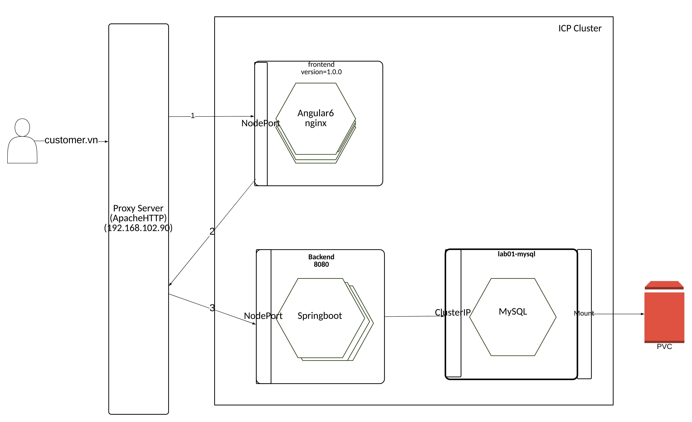

# Objectives

- Create a Persistent Volume Referencing a disk in your environment.
- Create a MySQL Deployment.
- Expose MySQL to other pods in the cluster at a known DNS name.
- Start up the web application using the Deployment
- Expose and view the Service.
- Clean up.

# Architecture



# Preparing

- install *docker*: https://www.docker.com/products/docker-desktop

- install *kubectl*: https://kubernetes.io/docs/tasks/tools/install-kubectl/

- Access ICP *https://192.168.104.50:8443* and login with credentials

- Copy the token, then pasting into the command line.


# Deployments
```
cd k8s
```

## Deploy MySQL Database


```
kubectl apply -f database.yaml

kubectl port-forward <new-mysql-pod> 3306:3306

mysql -uroot -p

mysql >
```

## Deploy backend
- Build image

```
docker build -t prod-cluster.icp:8500/<namespace>/<image_name>:<versiion> .

docker push prod-cluster.icp:8500/<namespace>/<image_name>:<versiion>

```

- deploy application

```
kubectl apply -f backend.yaml

kubectl describe deployment -l app=be


```

- Get the service NodePort exposed by backend

```
kubectl describe svc -l app=be

```

## Deploy frontend

1. Change the api address in *app/customer.service.ts* to be backend service

2. Build the angular app

4. Build the image


3. Deploy

```
kubectl apply -f frontend

kubectl describe deployment -l app=fe

kubectl describe svc -l app=fe

```

4. Access application using http via exposed service


# References

```

https://docs.docker.com/


https://kubernetes.io/docs/home/?path=users&persona=app-developer&level=foundational

https://www.ibm.com/support/knowledgecenter/en/SSBS6K_2.1.0.1/kc_welcome_containers.html

```
